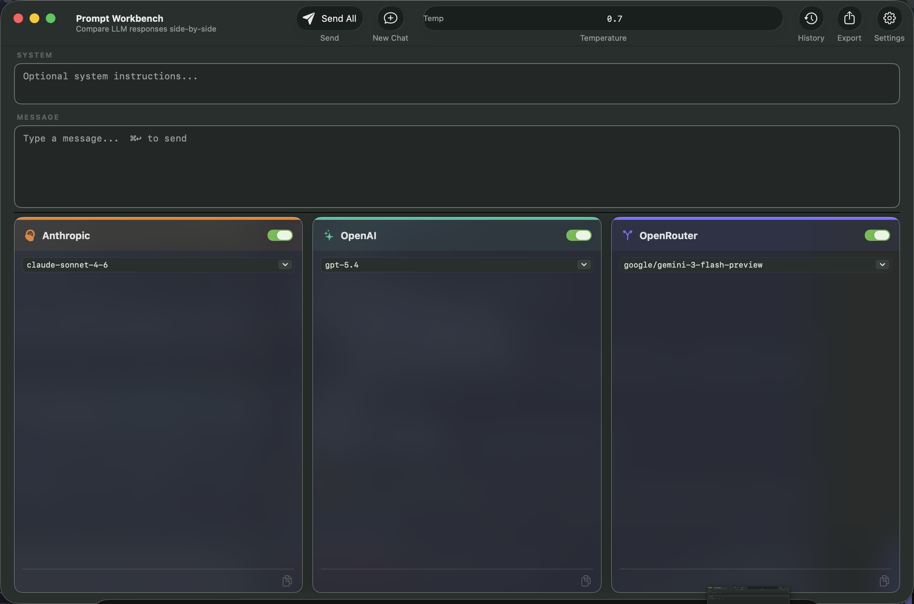
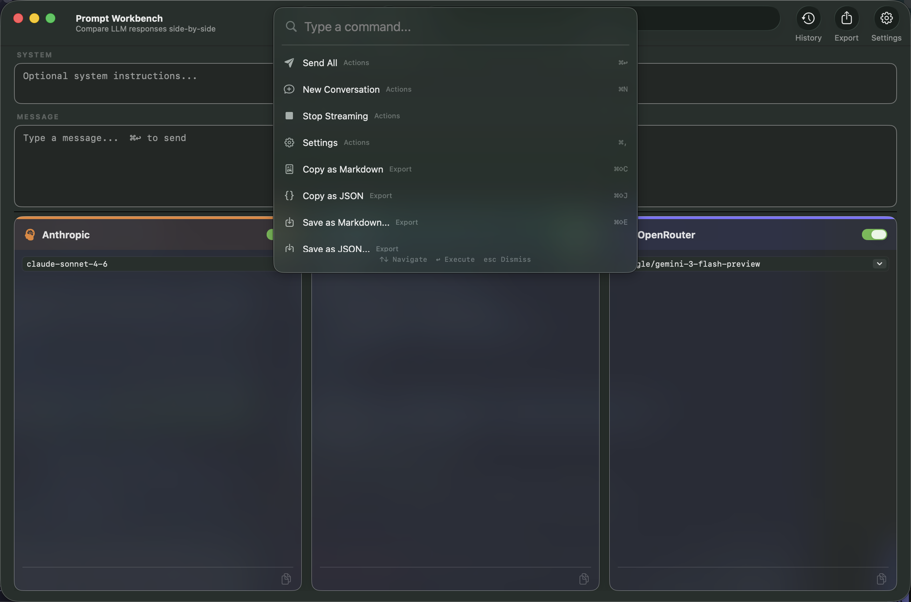

# Prompt Workbench

A native macOS app for comparing LLM responses side-by-side. Send the same prompt to Anthropic, OpenAI, and OpenRouter simultaneously and watch responses stream in real time.





## Features

- **Multi-provider streaming** — Real-time SSE streaming from Anthropic, OpenAI, and OpenRouter in parallel
- **Multi-turn conversations** — Each provider panel maintains its own conversation history with visual turn separators
- **Command palette** — `⌘K` opens a Spotlight-style command palette with fuzzy search across all actions
- **Prompt history** — Every prompt and response auto-saved, searchable, and re-sendable from the toolbar
- **Export/share** — Copy or save comparisons as Markdown or JSON (`⌘⇧C`, `⌘⇧J`, `⌘⇧E`)
- **Onboarding** — 4-step setup wizard for API keys, system prompt templates, and temperature preferences
- **Provider cards** — Accent-colored cards with drop shadows, frosted glass backgrounds, and per-panel metrics

## Keyboard Shortcuts

| Shortcut | Action |
|----------|--------|
| `⌘↩` | Send to all enabled providers |
| `⌘K` | Command palette |
| `⌘N` | New conversation |
| `⌘,` | Settings (API keys) |
| `⌘⇧C` | Copy comparison as Markdown |
| `⌘⇧J` | Copy comparison as JSON |
| `⌘⇧E` | Save as Markdown file |

## Supported Models

| Provider | Models |
|----------|--------|
| Anthropic | Claude Opus 4.6, Sonnet 4.6, Haiku 4.5 |
| OpenAI | GPT-5.4, GPT-5.4 Pro, GPT-5.2 Pro, o3-pro, o3, o4-mini, GPT-4.1 |
| OpenRouter | Gemini 3 Flash, Gemini 3.1 Pro, DeepSeek v3.2, Qwen 3.5, Mistral Large, Llama 3.3, Mercury-2 |

All model pickers are editable — type any model ID your provider supports.

## Build & Run

```bash
swift build && .build/debug/PromptWorkbench
```

Requires macOS 13+ and Swift 5.9+.

## Architecture

Pure AppKit, no SwiftUI or storyboards. Built with Swift Package Manager.

```
Sources/PromptWorkbench/
├── main.swift              # App entry point
├── AppDelegate.swift       # Menu bar, window lifecycle
├── MainWindow.swift        # Toolbar, split view, send orchestration
├── ResponsePanel.swift     # Per-provider card with conversation rendering
├── CommandPalette.swift    # ⌘K command palette
├── OnboardingWindow.swift  # 4-step setup wizard
├── HistoryPanel.swift      # Prompt history popover
├── HistoryStore.swift      # JSON persistence (~/.../PromptWorkbench/)
├── ExportService.swift     # Markdown/JSON export
├── LLMService.swift        # Multi-turn SSE streaming for all providers
├── SettingsWindow.swift    # API key configuration
└── Models.swift            # LLMProvider, ChatMessage, HistoryEntry
```
